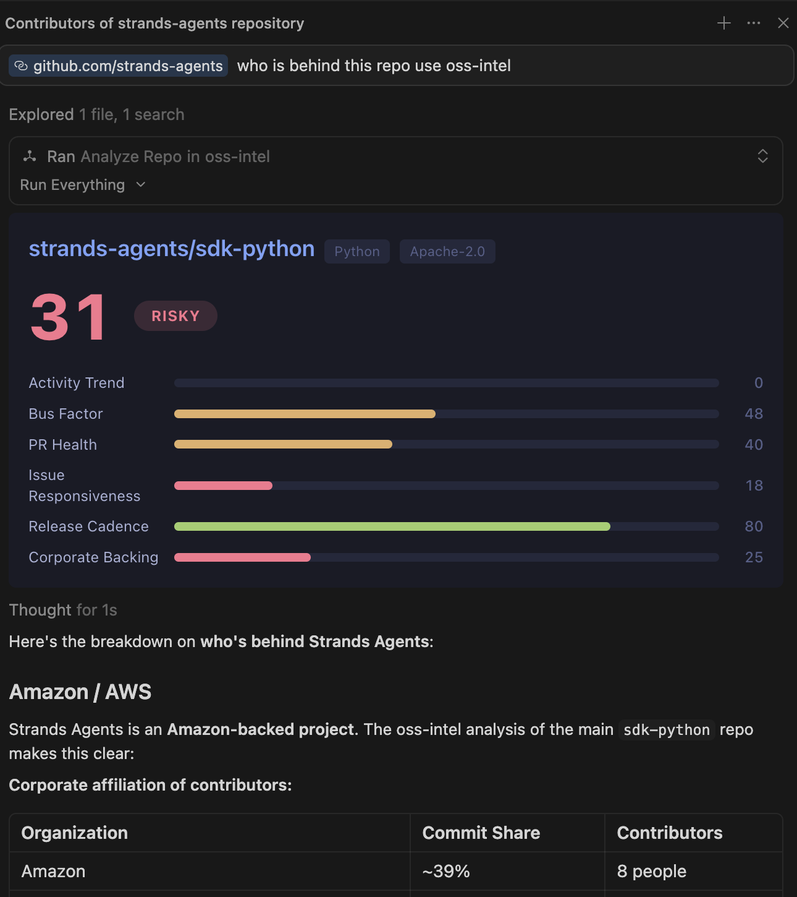
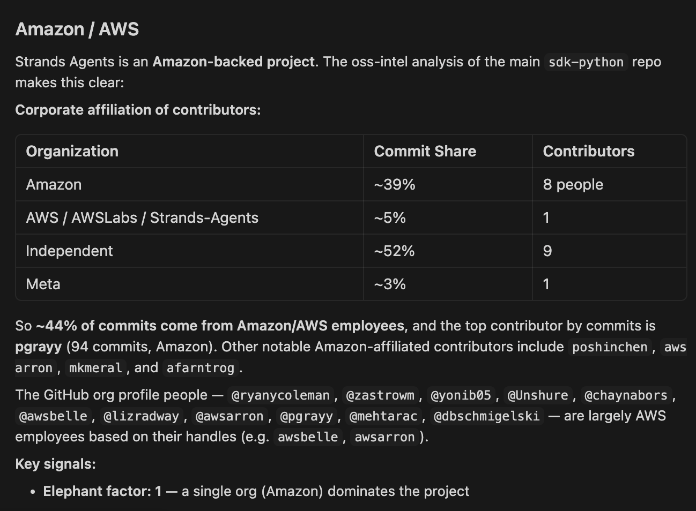

# OSS Intelligence MCP Server

[](https://github.com/jonzarecki/oss-intel-mcp/actions)
[](LICENSE)
[](https://nodejs.org)

<p align="center">
  
  
</p>


An MCP server that provides AI-native open-source repository intelligence. Ask questions about any GitHub repository and get structured, visual answers with interactive UI panels — directly inside Cursor, Claude Desktop, VS Code, or any MCP-compatible client.

## What It Does

Three tools answer two fundamental questions:

- **"Should I use this?"** — `analyze_repo` produces a comprehensive health report with an overall verdict (Safe / Caution / Risky), covering activity trends, bus factor, PR health, issue responsiveness, release cadence, corporate backing, and security score.
- **"Should I contribute?"** — `should_i_contribute` surfaces contributor experience signals: PR merge rates, review times, maintainer responsiveness, good first issues, and contributor retention.
- **"Which one is better?"** — `compare_repos` runs side-by-side analysis of 2–3 repos with per-metric winners and a recommendation.

Data comes from the GitHub REST API (primary) enriched by three free external APIs:
- [deps.dev](https://deps.dev) — Google's dependency intelligence (includes OpenSSF Scorecard)
- [OpenSSF Scorecard](https://scorecard.dev) — automated security assessment
- [OSS Insight](https://ossinsight.io) — pre-computed contributor affiliation data

All external APIs are optional — the server degrades gracefully to GitHub-only if any are unreachable.

## Quick Start

```bash
docker run -d -p 9847:9847 -e GITHUB_TOKEN=ghp_your_token_here ghcr.io/jonzarecki/oss-intel-mcp
```

Then configure your MCP client to connect:

**Cursor** — add to `~/.cursor/mcp.json`:

```json
{
  "mcpServers": {
    "oss-intel": {
      "url": "http://localhost:9847/mcp"
    }
  }
}
```

**Claude Desktop** — add to `~/Library/Application Support/Claude/claude_desktop_config.json` (macOS) or `%APPDATA%\Claude\claude_desktop_config.json` (Windows):

```json
{
  "mcpServers": {
    "oss-intel": {
      "url": "http://localhost:9847/mcp"
    }
  }
}
```

### Get a GitHub Token

Create a personal access token at [github.com/settings/tokens](https://github.com/settings/tokens). The only scope needed is `public_repo` (read-only access to public repos).

## Tools

### `analyze_repo(owner, repo)`

Full health report with overall verdict.

**Example prompt:** "Analyze the health of expressjs/express"

**Returns:** Verdict (Safe/Caution/Risky), score (0–100), 8 metric breakdowns, enrichment source indicators.

**UI Panel:** "Should I Use This?" verdict card with stats grid, breakdown chart, corporate backing, and security score.

### `should_i_contribute(owner, repo)`

Contributor experience analysis.

**Example prompt:** "Should I contribute to facebook/react?"

**Returns:** PR merge rates, review times, maintainer responsiveness, good first issue count, contributor retention.

**UI Panel:** "Is It Worth Contributing?" dashboard with PR funnel, review gauge, and retention bar.

### `compare_repos(repos)`

Side-by-side comparison of 2–3 repos.

**Example prompt:** "Compare express, fastify, and koa"

**Returns:** Per-metric comparison table with winners, overall recommendation.

## Metrics

| Metric | Method | Weight in Verdict |
|--------|--------|-------------------|
| Activity Trend | 3-month commit volume comparison | 20% |
| Bus Factor | Gini coefficient of commit distribution | 17% |
| PR Health | Merge rate + review time + merge time | 17% |
| Security | OpenSSF Scorecard (17 checks) | 17% |
| Issue Responsiveness | Response time + close rate | 13% |
| Release Cadence | Interval regularity + frequency | 8% |
| Corporate Backing | Org diversity + contribution share | 8% |

When security data is unavailable, remaining metrics re-normalize to 100%.

## License

MIT
